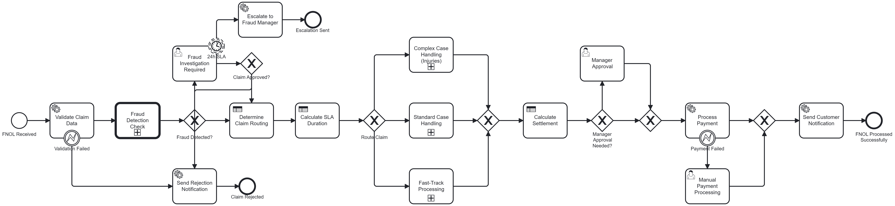
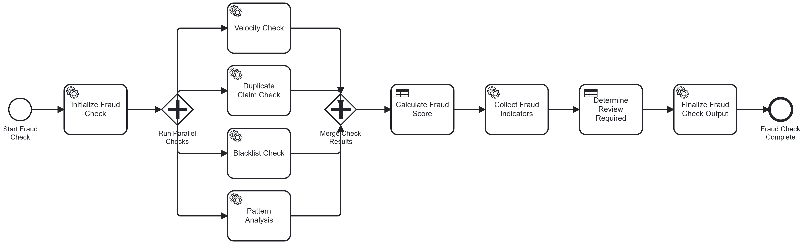

# GCC Motor FNOL with Camunda 8

<p align="center">
  
</p>

<p align="center">
  <strong>🚗 Complete Motor Insurance Claims Automation for the Gulf Cooperation Council Region</strong>
</p>

<p align="center">
  <a href="#-quick-start">Quick Start</a> •
  <a href="#-bpmn-process-diagrams">BPMN</a> •
  <a href="#-dmn-decision-tables">DMN</a> •
  <a href="#-camunda-forms">Forms</a> •
  <a href="#️-multilingual-support">Languages</a> •
  <a href="#-api-example">API</a>
</p>

---

[](https://github.com/camunda-community-hub/community)
[](https://github.com/Camunda-Community-Hub/community/blob/main/extension-lifecycle.md#incubating-)
[](LICENSE)
[](https://camunda.com)
[](https://openjdk.org)
[](https://spring.io/projects/spring-boot)

---

## 🌍 Built for the GCC Region

| Country | Flag | National ID | Vehicle Reg. | Currency | Phone |
|---------|:----:|-------------|--------------|:--------:|:-----:|
| **UAE** | 🇦🇪 | Emirates ID | Mulkiya (ملكية) | AED (د.إ) | +971 |
| **Saudi Arabia** | 🇸🇦 | Iqama/National ID | Istimara (استمارة) | SAR (ر.س) | +966 |
| **Kuwait** | 🇰🇼 | Civil ID | Daftar (دفتر) | KWD (د.ك) | +965 |
| **Qatar** | 🇶🇦 | QID | Istemara (استمارة) | QAR (ر.ق) | +974 |
| **Bahrain** | 🇧🇭 | CPR | Vehicle Registration Card | BHD (د.ب) | +973 |
| **Oman** | 🇴🇲 | National ID | Mulkiya (ملكية) | OMR (ر.ع) | +968 |

### GCC-Specific Features

- ✅ **National ID Validation** - Emirates ID, Iqama, Civil ID, QID, CPR formats
- ✅ **Phone Number Validation** - Country-specific mobile prefixes (+971, +966, etc.)
- ✅ **License Plate Formats** - UAE, Saudi, Kuwait, Qatar, Bahrain, Oman patterns
- ✅ **Vehicle Registration Terms** - Mulkiya, Istimara, Daftar (country-specific)
- ✅ **RTL Language Support** - Arabic and Urdu with right-to-left rendering
- ✅ **Multi-Currency Support** - AED, SAR, KWD, QAR, BHD, OMR with Arabic symbols
- ✅ **GCC Insurance Standards** - TPL and Comprehensive coverage types

---

## 🗣️ Multilingual Support

<table>
<tr>
<th>Language</th>
<th>Native Name</th>
<th>Script</th>
<th>Direction</th>
<th>Primary Countries</th>
</tr>
<tr>
<td>🇬🇧 English</td>
<td>English</td>
<td>Latin</td>
<td>LTR →</td>
<td>All GCC (Business)</td>
</tr>
<tr>
<td>🇸🇦 Arabic</td>
<td><b>العربية</b></td>
<td>Arabic</td>
<td><b>RTL ←</b></td>
<td>All GCC (Official)</td>
</tr>
<tr>
<td>🇮🇳 Hindi</td>
<td>हिन्दी</td>
<td>Devanagari</td>
<td>LTR →</td>
<td>UAE, Saudi, Kuwait</td>
</tr>
<tr>
<td>🇵🇰 Urdu</td>
<td><b>اردو</b></td>
<td>Nastaliq</td>
<td><b>RTL ←</b></td>
<td>UAE, Saudi, Qatar</td>
</tr>
<tr>
<td>🇮🇳 Malayalam</td>
<td>മലയാളം</td>
<td>Malayalam</td>
<td>LTR →</td>
<td>UAE, Kuwait, Qatar</td>
</tr>
<tr>
<td>🇵🇭 Tagalog</td>
<td>Filipino</td>
<td>Latin</td>
<td>LTR →</td>
<td>UAE, Saudi, Kuwait</td>
</tr>
</table>

> **Why these languages?** The GCC workforce is highly diverse. These 6 languages cover **95%+ of the population** in the Gulf region.

---

## 🚀 Quick Start

### Download

[](https://github.com/ganeshkumargunaseelan-web/camunda-fnol-automation/releases/download/v1.0.0/gcc-motor-fnol-starter-1.0.0.jar)

Or go to [Releases](https://github.com/ganeshkumargunaseelan-web/camunda-fnol-automation/releases/tag/v1.0.0) to download.

### Prerequisites
- **Java 21** or higher
- **Camunda 8 SaaS account** (optional for demo mode)
- **Camunda Modeler** (optional, for viewing BPMN/DMN files)

### Option 1: Demo Mode (No Dependencies)

```bash
java -jar gcc-motor-fnol-starter-1.0.0.jar --spring.profiles.active=demo
```

Open **http://localhost:8080** - you'll see the multilingual FNOL form.

### Option 2: With Camunda 8 Cloud

```bash
export CAMUNDA_CLOUD_CLUSTER_ID=your-cluster-id
export CAMUNDA_CLOUD_CLIENT_ID=your-client-id
export CAMUNDA_CLOUD_CLIENT_SECRET=your-client-secret
export CAMUNDA_CLOUD_REGION=bru-2

java -jar gcc-motor-fnol-starter-1.0.0.jar
```

---

## 📊 BPMN Process Diagrams

> **📁 Download:** All BPMN files are in the [`src/main/resources/bpmn/`](src/main/resources/bpmn/) folder. Open them with [Camunda Modeler](https://camunda.com/download/modeler/).

### 1. Main FNOL Claims Process

**File:** [`gcc-motor-fnol-process.bpmn`](src/main/resources/bpmn/gcc-motor-fnol-process.bpmn)



*Main FNOL Claims Process showing validation, fraud detection, routing, claim handling, settlement, payment, and notification stages*

**Camunda 8 Elements:**

| Element | BPMN Type | Implementation |
|---------|-----------|----------------|
|  Validate Claim | Service Task | Job Worker: `fnol-validate-claim` |
|  Fraud Check | Call Activity | Process: `fraud-detection-process` |
|  Routing Decision | Business Rule Task | DMN: `fnol-routing-decision` |
|  Claims Review | User Task | Form: `claims-review-form.form` |
|  Senior Review | User Task | Form + Timer Boundary (48h) |
|  Settlement DMN | Business Rule Task | DMN: `settlement-calculation-decision` |
|  Manager Approval | User Task | Form: `manager-approval-form.form` |
|  Process Payment | Service Task | Job Worker + Error Boundary |
|  Notify Customer | Service Task | Job Worker: `fnol-send-notification` |

---

### 2. Fraud Detection Sub-Process

**File:** [`fraud-detection-process.bpmn`](src/main/resources/bpmn/fraud-detection-process.bpmn)



*Fraud Detection Sub-Process with parallel fraud checks (claim history, vehicle history, location pattern, timing pattern) and DMN-based fraud scoring*

**Output Variables:**
| Variable | Type | Values |
|----------|------|--------|
| `fraudScore` | Integer | 0-100 |
| `riskLevel` | String | `LOW` \| `MEDIUM` \| `HIGH` |
| `requiresInvestigation` | Boolean | true/false |

---

## 📋 DMN Decision Tables

> **📁 Download:** All DMN files are in the [`src/main/resources/dmn/`](src/main/resources/dmn/) folder. Open them with [Camunda Modeler](https://camunda.com/download/modeler/).

### 1. Claim Routing Decision

**File:** [`fnol-routing-decision.dmn`](src/main/resources/dmn/fnol-routing-decision.dmn) | **Hit Policy:** FIRST (F)

| # | hasInjuries | isDrivable | hasThirdParty | estimatedDamage | → route | → priority | → slaHours |
|:-:|:-----------:|:----------:|:-------------:|:---------------:|:-------:|:----------:|:----------:|
| 1 | ✅ true | - | - | - | `complex` | 1 | 48 |
| 2 | - | ❌ false | ✅ true | - | `complex` | 2 | 48 |
| 3 | - | ❌ false | - | > 50,000 | `standard` | 2 | 24 |
| 4 | - | ❌ false | - | ≤ 50,000 | `standard` | 3 | 24 |
| 5 | - | ✅ true | ✅ true | > 20,000 | `standard` | 3 | 24 |
| 6 | - | ✅ true | ❌ false | ≤ 20,000 | `fast-track` | 4 | 4 |
| 7 | - | ✅ true | - | ≤ 10,000 | `fast-track` | 5 | 4 |

---

### 2. SLA Duration Decision

**File:** [`sla-duration-decision.dmn`](src/main/resources/dmn/sla-duration-decision.dmn) | **Hit Policy:** UNIQUE (U)

| # | route | priority | → escalationTimer | → notifyManager | → autoEscalate |
|:-:|:-----:|:--------:|:-----------------:|:---------------:|:--------------:|
| 1 | `complex` | 1 | PT2H | ✅ true | ✅ true |
| 2 | `complex` | 2 | PT4H | ✅ true | ✅ true |
| 3 | `standard` | 2 | PT8H | ✅ true | ❌ false |
| 4 | `standard` | 3 | PT12H | ❌ false | ❌ false |
| 5 | `fast-track` | 4 | PT2H | ❌ false | ❌ false |
| 6 | `fast-track` | 5 | PT4H | ❌ false | ❌ false |

---

### 3. Fraud Score Calculation

**File:** [`fraud-score-calculation.dmn`](src/main/resources/dmn/fraud-score-calculation.dmn) | **Hit Policy:** COLLECT SUM (C+)

| # | claimFrequency | daysSincePolicy | locationRisk | vehicleAge | → scorePoints |
|:-:|:--------------:|:---------------:|:------------:|:----------:|:-------------:|
| 1 | > 3/year | - | - | - | +25 |
| 2 | - | < 30 days | - | - | +20 |
| 3 | - | - | HIGH | - | +20 |
| 4 | - | - | - | > 10 years | +15 |
| 5 | > 2/year | < 90 days | MEDIUM | > 7 years | +20 |

**Final Risk Level:**
- 🟢 **LOW**: Score 0-59
- 🟡 **MEDIUM**: Score 60-84
- 🔴 **HIGH**: Score 85-100

---

### 4. Settlement Calculation Decision

**File:** [`settlement-calculation-decision.dmn`](src/main/resources/dmn/settlement-calculation-decision.dmn) | **Hit Policy:** FIRST (F)

| # | coverageType | damageType | → settlementAmount | → deductible | → requiresApproval |
|:-:|:------------:|:----------:|:------------------:|:------------:|:------------------:|
| 1 | `COMPREHENSIVE` | TOTAL_LOSS | 100% vehicle value | 0 | if > 50,000 |
| 2 | `COMPREHENSIVE` | MAJOR | Repair cost | 500 | if > 50,000 |
| 3 | `COMPREHENSIVE` | MINOR | Repair cost | 250 | ❌ false |
| 4 | `TPL` | ANY | Third party cost | 1,000 | if > 30,000 |

---

## 📝 Camunda Forms

> **📁 Download:** All form files are in the [`src/main/resources/forms/`](src/main/resources/forms/) folder. Open them with [Camunda Modeler](https://camunda.com/download/modeler/).

| Form File | Used In | Purpose |
|-----------|---------|---------|
| [`claims-review-form.form`](src/main/resources/forms/claims-review-form.form) | Standard Claims Review | Adjuster reviews claim details |
| [`senior-review-form.form`](src/main/resources/forms/senior-review-form.form) | Complex Claims Review | Senior adjuster for complex cases |
| [`fraud-investigation-form.form`](src/main/resources/forms/fraud-investigation-form.form) | Fraud Investigation | Fraud analyst investigation |
| [`manager-approval-form.form`](src/main/resources/forms/manager-approval-form.form) | Manager Approval | Manager approves high-value claims |

---

## 🔧 Camunda 8 Features Summary

| Feature | Files | Description |
|---------|-------|-------------|
| **BPMN Service Tasks** | `gcc-motor-fnol-process.bpmn` | 15+ Job Workers for validation, payment, notification |
| **Business Rule Tasks** | `*.dmn` | 4 DMN decision tables integrated in BPMN |
| **User Tasks + Forms** | `*.form` | 4 Camunda Forms for human tasks |
| **Call Activity** | Both `.bpmn` files | Fraud detection as reusable sub-process |
| **Parallel Gateway** | `fraud-detection-process.bpmn` | Run 4 fraud checks simultaneously |
| **Timer Boundary Events** | `gcc-motor-fnol-process.bpmn` | SLA escalation (4h/24h/48h) |
| **Error Boundary Events** | `gcc-motor-fnol-process.bpmn` | Fallback to manual tasks on error |
| **Message Events** | `gcc-motor-fnol-process.bpmn` | External system integration |
| **Escalation Events** | `gcc-motor-fnol-process.bpmn` | Supervisor notification on SLA breach |

---

## 📡 API Example

### Submit a Claim (UAE Example)

```bash
curl -X POST http://localhost:8080/api/v1/fnol \
  -H "Content-Type: application/json" \
  -H "X-Idempotency-Key: unique-123" \
  -d '{
    "countryCode": "AE",
    "mobileNumber": "+971501234567",
    "nationalId": "784-1234-5678901-1",
    "name": "أحمد المكتوم",
    "email": "ahmed@example.com",
    "plateNumber": "A12345",
    "plateCountry": "AE",
    "vehicleType": "SEDAN",
    "make": "Toyota",
    "model": "Camry",
    "year": 2023,
    "policyNumber": "POL-123456",
    "coverageType": "COMPREHENSIVE",
    "incidentDate": "2025-01-15",
    "incidentTime": "14:30",
    "incidentLocation": "Dubai Marina",
    "description": "حادث بسيط في موقف السيارات",
    "isDrivable": true,
    "hasInjuries": false,
    "hasThirdParty": false,
    "preferredLanguage": "AR"
  }'
```

### Response

```json
{
  "fnolId": "FNOL-AE-2025-000001",
  "status": "SUBMITTED",
  "severityLevel": "LOW",
  "route": "fast-track",
  "priority": 5,
  "slaHours": 4,
  "processInstanceKey": "2251799813685270",
  "isDuplicate": false,
  "submittedAt": "2025-01-15T14:35:22Z",
  "message": "تم استلام مطالبتك بنجاح"
}
```

---

## 👨‍💻 Author

<table>
<tr>
<td>
<strong>G. Ganesh Kumar</strong><br/>
Solution Architect<br/><br/>
📱 UAE: +971-55-816-0396<br/>
💬 WhatsApp: +91-95000-03051<br/>
</td>
</tr>
</table>

---

## 📄 License

Copyright 2025 G. Ganesh Kumar


---


---

## 🏷️ Topics

`camunda` `camunda-8` `bpmn` `dmn` `camunda-forms` `workflow-automation` `insurance` `fnol` `claims-management` `gcc` `uae` `saudi-arabia` `kuwait` `qatar` `bahrain` `oman` `motor-insurance` `spring-boot` `java` `react` `multilingual` `arabic` `rtl` `zeebe` `hexagonal-architecture`

---

<p align="center">
  <sub>Made with ❤️ for the GCC Insurance Industry</sub>
</p>
